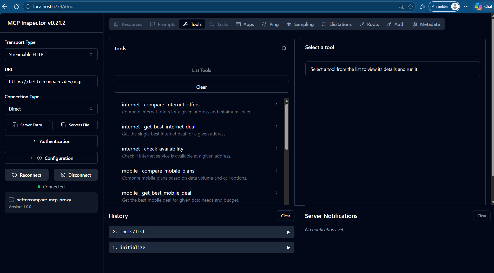
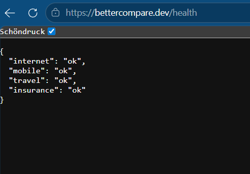
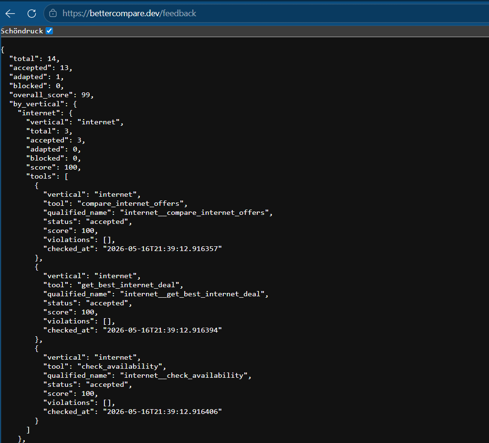
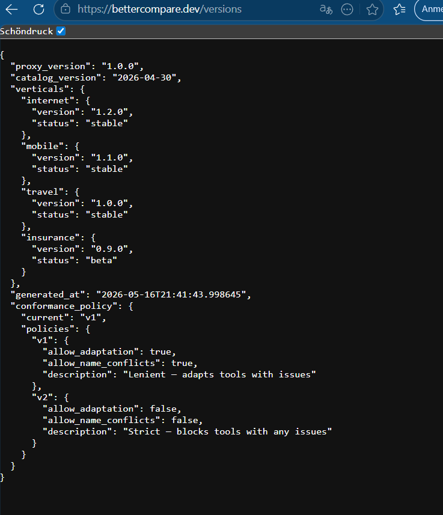
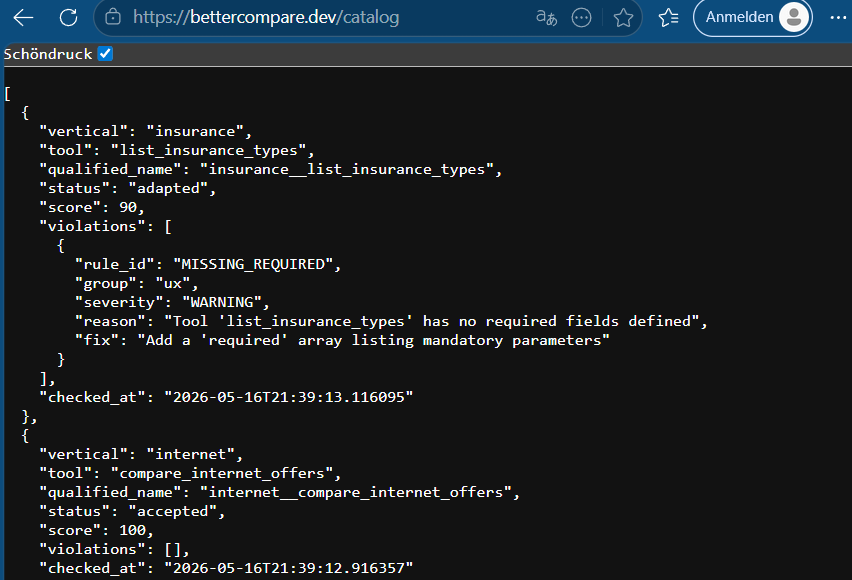
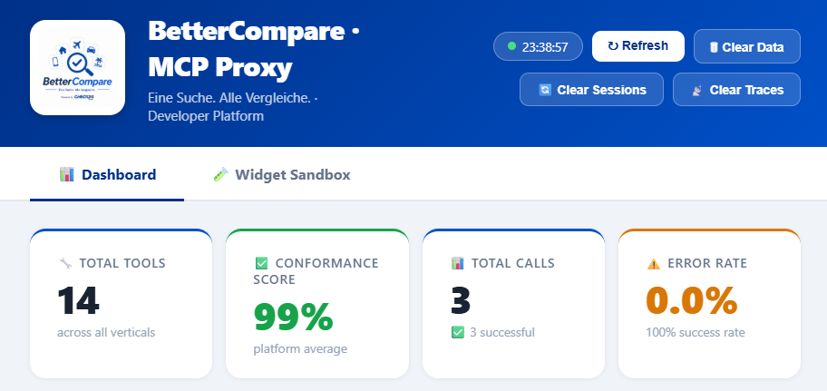
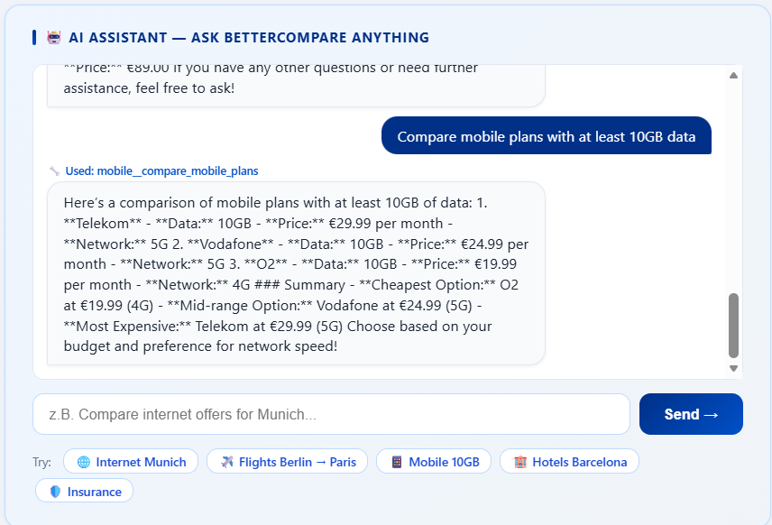
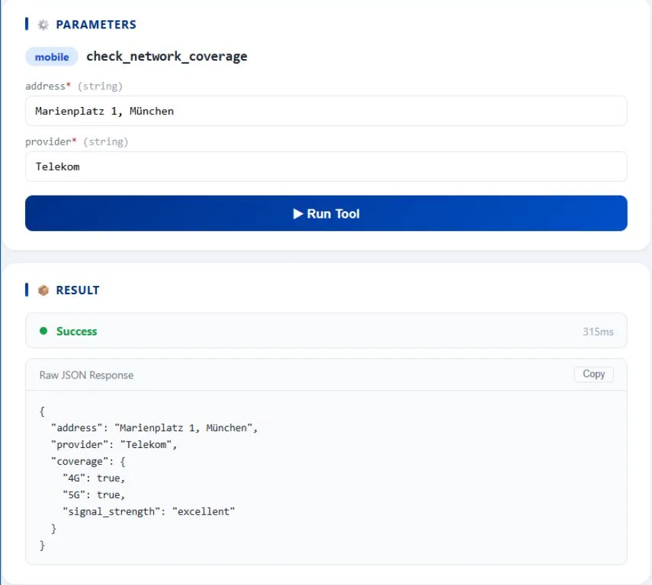
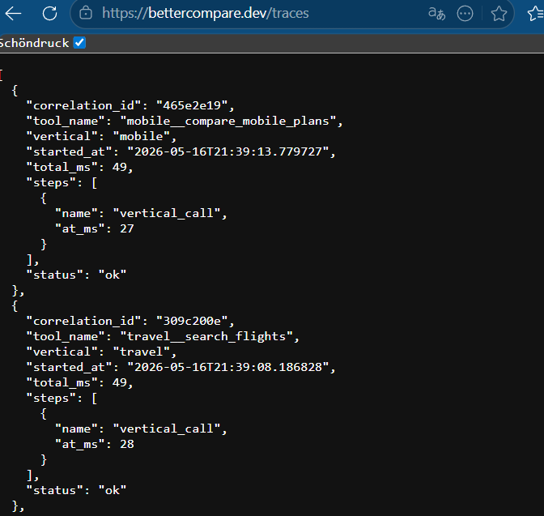

# GenDev9 – CHECK24 ChatGPT App Challenge
**BetterCompare – One Search. Every Comparison.**
[🎥 Demo Video](#) · [📊 Dashboard](https://bettercompare.dev/dashboard) · [🌐 MCP Endpoint](https://bettercompare.dev/mcp) · [🧪 Widget Sandbox](https://bettercompare.dev/dashboard)

> 🇩🇪 **Deutsche Version** weiter unten / German version below

---

## 📋 Table of Contents

- [Intro](#intro)
- [🚀 Live Demo](#-live-demo)
- [🎥 Video](#-video)
- [🔍 How to Test](#-how-to-test)
- [📁 Repository Structure](#-repository-structure)
- [✅ Challenge Requirements](#-challenge-requirements)
- [🏗️ Architecture](#️-architecture)
- [🔌 API Reference](#-api-reference)
- [⭐ Optional Features](#-optional-features)
- [🔒 Security Considerations](#-security-considerations)
- [☁️ Deployment](#️-deployment)
- [🚧 Known Limitations](#-known-limitations--trade-offs)
- [🧠 Key Design Decisions](#-key-design-decisions)
- [🎓 Learnings & Reflections](#-learnings--reflections)
- [📚 Documentation](#-documentation)
- [🇩🇪 Deutsche Version](#-deutsche-version)

> 👉 **Reviewer? Start here:** [How to Test](#-how-to-test) · [Live Demo](#-live-demo) · [MCP Endpoint](https://bettercompare.dev/mcp)

---

## Intro

Thank you for taking the time to look at my project for the CHECK24 GenDev Scholarship.

The challenge grabbed me from the start: how do you bring multiple independent APIs together in a way that an AI model like ChatGPT can use them cleanly and reliably without chaos, naming conflicts, or blind spots? That's exactly what I set out to solve with BetterCompare, a ChatGPT-native MCP proxy that aggregates multiple CHECK24 comparison verticals into a single unified interface, powered by a conformance engine, live monitoring, and structured developer feedback.

It was my first time diving deep into the MCP protocol, and I quickly realized how much care it takes to make tools truly ChatGPT-ready: clear descriptions, consistent schemas, meaningful error messages. What looks like a simple routing problem at first glance turns into a question of architecture and trust as the proxy needs to work as a reliable gatekeeper, not just a pass-through.

The heart ❤️ of the project is the Conformance Engine: it validates every tool against structured rules and gives vertical teams concrete, actionable feedback. It is not just a rejection, but a clear "here's the problem, and here's how to fix it." That part was especially satisfying to build.


---

## 🚀 Live Demo

| Service | URL |
|---|---|
| 🌐 Proxy MCP Endpoint | https://bettercompare.dev/mcp |
| 📊 Monitoring Dashboard | https://bettercompare.dev/dashboard |
| 🧪 Widget Sandbox | https://bettercompare.dev/dashboard (Sandbox Tab) |
| 🔍 OpenAPI Schema | https://bettercompare.dev/openapi-schema |
| 💬 Feedback | https://bettercompare.dev/feedback |
| 📋 Catalog | https://bettercompare.dev/catalog |
| 🔢 Versions | https://bettercompare.dev/versions |
| 📡 Traces | https://bettercompare.dev/traces |
| ❤️ Health | https://bettercompare.dev/health |

> ⚠️ ChatGPT connects **only** to the proxy MCP. All vertical MCPs run internally and are never exposed directly.

---

## 🎥 Video

📺 **Demo Video:** `<VIDEO_LINK_HERE>`

The video covers:
- Architecture explanation
- Live dashboard walkthrough
- Widget Sandbox demo
- ChatGPT tool call demonstration
- Conformance engine in action
- Versioning and feedback system

---

## 🔍 How to Test

```bash
# 1. Check vertical health
curl https://bettercompare.dev/health

# 2. Connect MCP Inspector
npx @modelcontextprotocol/inspector https://bettercompare.dev/mcp

# 3. See conformance feedback
curl https://bettercompare.dev/feedback?vertical=insurance

# 4. Open the dashboard
https://bettercompare.dev/dashboard

# 5. Test any tool in the Widget Sandbox
https://bettercompare.dev/dashboard → Widget Sandbox Tab → Select tool → Run
```





---

## 📁 Repository Structure

```
BetterCompare/
├── proxy/
│   ├── main.py                  ← MCP proxy core
│   ├── requirements.txt         ← Python dependencies
│   ├── conformance/
│   │   └── engine.py            ← Rule engine (schema, safety, naming, UX)
│   ├── monitoring/
│   │   ├── tracer.py            ← Per-request tracing with correlation IDs
│   │   ├── stats.py             ← Metrics aggregation per vertical
│   │   └── session_store.py     ← Session-level tool usage tracking
│   ├── feedback/
│   │   └── store.py             ← Actionable feedback per vertical team
│   ├── catalog/
│   │   └── versions.py          ← Versioning + breaking change detection
│   ├── dashboard/
│   │   ├── index.html           ← Live monitoring dashboard + Widget Sandbox
│   │   └── BetterCompare.png    ← Logo
│   └── verticals/
│       ├── internet/main.py     ← Port 8801
│       ├── mobile/main.py       ← Port 8802
│       ├── travel/main.py       ← Port 8803
│       └── insurance/main.py    ← Port 8804
├── docs/
│   ├── EN_01_overview.md        ← System overview (EN)
│   ├── EN_02_conformance.md     ← Conformance engine (EN)
│   ├── EN_03_versioning.md      ← Versioning (EN)
│   ├── EN_04_qa_monitoring.md   ← QA & monitoring (EN)
│   ├── DE_01_uebersicht.md      ← Systemübersicht (DE)
│   └── DE_02_conformance_versioning_qa.md ← Conformance, Versioning, QA (DE)
├── Dockerfile
├── start.sh
└── privacy.md
```

---

## ✅ Challenge Requirements

### Single ChatGPT-facing Proxy MCP
- [x] Exactly one MCP endpoint: `POST https://bettercompare.dev/mcp`
- [x] The proxy implements the MCP JSON-RPC protocol directly, giving full control over tool aggregation, routing, and conformance — while all vertical backends use the official MCP Python SDK with Streamable HTTP
- [x] All verticals hidden behind the proxy
- [x] Transport layer deliberately decoupled from business logic — another MCP host (e.g. Claude) could reuse the core

→ Full details: [docs/EN_01_overview.md](docs/EN_01_overview.md)

### Vertical MCPs (Mocked)
- [x] 4 independent MCP servers, each owning their own tools and schemas
- [x] Internet, Mobile, Travel, Insurance — each with real FastMCP Streamable HTTP transport

| Vertical | Tools | Port |
|---|---|---|
| Internet | compare_internet_offers, get_best_internet_deal, check_availability | 8801 |
| Mobile | compare_mobile_plans, get_best_mobile_deal, check_network_coverage, compare_phone_hardware | 8802 |
| Travel | search_travel_offers, search_flights, search_hotels, get_travel_insurance | 8803 |
| Insurance | compare_insurance_plans, get_insurance_quote, list_insurance_types | 8804 |

### Conformance Engine
- [x] Every tool evaluated before exposure
- [x] `fix` field gives teams exactly what to change
- [x] Policy v1 (lenient) and v2 (strict)

Every tool is evaluated against structured rules before exposure:

```json
{
  "rule_id": "MISSING_DESCRIPTION",
  "group": "schema",
  "severity": "WARNING",
  "reason": "Tool 'get_insurance_quote' has no meaningful description",
  "fix": "Add a description of at least 10 characters explaining what the tool does"
}
```

Rules are grouped into: `schema`, `safety`, `naming`, `ux`



→ Full conformance details: [docs/EN_02_conformance.md](docs/EN_02_conformance.md)

### Versioning
- [x] Explicit version per component
- [x] Breaking change detection automatic
- [x] Who does the work when something changes documented

```json
{
  "proxy_version": "1.0.0",
  "catalog_version": "2026-04-30",
  "verticals": {
    "internet": {"version": "1.2.0", "status": "stable"},
    "insurance": {"version": "0.9.0", "status": "beta"}
  }
}
```



**Who does the work when something changes?**

| Change type | Who acts | Review needed? |
|---|---|---|
| Non-breaking (optional param, better description) | Vertical team bumps minor → proxy operator calls `/reload` | No |
| Breaking change (new required param, type change) | Proxy detects automatically → teams coordinate → major version bump | Likely yes |
| New conformance rule | Proxy operator adds rule → all verticals re-evaluated → teams notified via `/feedback` | Depends |

→ Full versioning details: [docs/EN_03_versioning.md](docs/EN_03_versioning.md)

### Feedback to Verticals
- [x] `GET /feedback?vertical=X` returns structured feedback
- [x] No silent blocking — always with fix suggestion

`GET /feedback?vertical=insurance` returns structured feedback with a `fix` field — teams know exactly what to change, not just that something is wrong.

→ Full feedback details: [docs/EN_02_conformance.md](docs/EN_02_conformance.md)

---

## 🏗️ Architecture

```
ChatGPT / MCP Inspector
         │
         ▼
┌────────────────────────────────────┐
│      BetterCompare MCP Proxy       │
│        bettercompare.dev           │
│                                    │
│  ┌─────────────┐ ┌──────────────┐  │
│  │ Conformance │ │   Routing    │  │
│  │   Engine    │ │ + Namespace  │  │
│  └─────────────┘ └──────────────┘  │
│  ┌─────────────┐ ┌──────────────┐  │
│  │  Monitoring │ │   Feedback   │  │
│  │  + Tracing  │ │   Engine     │  │
│  └─────────────┘ └──────────────┘  │
└──────────────┬─────────────────────┘
               │ internal only (MCP SDK ClientSession)
    ┌──────────┼──────────┬──────────┐
    ▼          ▼          ▼          ▼
 :8801      :8802      :8803      :8804
Internet   Mobile     Travel   Insurance
```

→ Full architecture details: [docs/EN_01_overview.md](docs/EN_01_overview.md)

---

## 🔌 API Reference

| Endpoint | Method | Description |
|---|---|---|
| `/mcp` | POST | MCP endpoint for ChatGPT |
| `/mcp?vertical=internet` | POST | QA mode — only internet tools |
| `/health` | GET | Vertical reachability |
| `/catalog` | GET | Full tool catalog |
| `/feedback` | GET | Conformance feedback (all verticals) |
| `/feedback?vertical=X` | GET | Feedback for one vertical |
| `/traces` | GET | Recent tool call traces |
| `/stats` | GET | Aggregated metrics |
| `/sessions` | GET | Session-level tool usage |
| `/versions` | GET | Version manifest |
| `/versions/check?vertical=X` | GET | Per-vertical version status |
| `/dashboard` | GET | Live monitoring dashboard + Widget Sandbox |
| `/validate` | POST | Dry-run conformance check for any tool |
| `/reload` | POST | Invalidate tool cache |
| `/openapi-schema` | GET | OpenAPI schema for ChatGPT Actions |



### Per-Vertical QA Mode
```bash
# Via query param
POST https://bettercompare.dev/mcp?vertical=internet

# Via header
POST https://bettercompare.dev/mcp
x-vertical: internet
```

Why query param over separate deployments? Zero infrastructure changes, same connector URL, toggleable per request.

→ Full QA details: [docs/EN_04_qa_monitoring.md](docs/EN_04_qa_monitoring.md)

### Connecting to ChatGPT
1. Go to [chatgpt.com/gpts/editor](https://chatgpt.com/gpts/editor)
2. Click **Configure** → **Actions** → **Add actions**
3. Click **Import from URL** and enter: `https://bettercompare.dev/openapi-schema`
4. ChatGPT will discover all tools automatically

---

## ⭐ Optional Features

### Cross-Vertical Namespacing
All tools are namespaced as `vertical__tool_name`:
- `internet__compare_internet_offers`
- `travel__search_flights`

Prevents naming conflicts between verticals. ChatGPT always knows which vertical owns which tool.

### Live Monitoring Dashboard + AI Assistant



`https://bettercompare.dev/dashboard`

Shows:
- Total tools + conformance score
- Vertical health (green/amber/red)
- Conformance violations with fix suggestions
- Live trace timeline
- Session flows
- Top tools by usage
- **AI Assistant** — ask BetterCompare anything in natural language, it routes to the right vertical tool automatically



### 🧪 Widget Sandbox



`https://bettercompare.dev/dashboard` → Widget Sandbox tab

Vertical teams can test any tool in isolation — through the same proxy path ChatGPT uses. Select a tool, fill in parameters, see the live result with widget preview and raw JSON.

→ Full sandbox details: [docs/EN_04_qa_monitoring.md](docs/EN_04_qa_monitoring.md)

### Session-Level Insights
`GET /sessions` tracks tool usage across a conversation:

```json
{
  "session_id": "sess_abc123",
  "flow": "internet__compare_internet_offers → travel__search_flights",
  "total_calls": 2,
  "verticals_used": ["internet", "travel"]
}
```

### Structured Tracing
Every tool call gets a `correlation_id` with per-step latency:

```json
{
  "correlation_id": "req_a3f9",
  "tool_name": "internet__compare_internet_offers",
  "total_ms": 142,
  "steps": [
    {"name": "vertical_call", "at_ms": 11}
  ],
  "status": "ok"
}
```



→ Full monitoring details: [docs/EN_04_qa_monitoring.md](docs/EN_04_qa_monitoring.md)

### Dry-Run Validator
Teams can validate tool definitions before deploying:

```bash
POST /validate
{
  "vertical": "insurance",
  "tool": { "name": "get_quote", "description": "...", "input_schema": {...} }
}
```

Returns full conformance report without touching the live catalog.

---

## 🔒 Security Considerations

- **Tool exposure**: Conformance layer blocks admin/debug tools from leaking to ChatGPT
- **Input validation**: JSON Schema validation on every tool call
- **Trust boundaries**: Proxy trusts vertical responses at application level. Production would use mTLS between proxy and verticals
- **No auth on proxy**: Correct for developer/connector mode. Production would add API key or OAuth at gateway layer
- **What to harden next**: Rate limiting per session, request size limits, circuit breakers for unreachable verticals, audit logging

---

## ☁️ Deployment

Runs as a single Docker container on Railway:

```bash
# Local
docker build -t bettercompare .
docker run -p 8787:8787 bettercompare
```

Deployed at: **https://bettercompare.dev**

---

## 🚧 Known Limitations & Trade-offs

| What | Simplified | Production improvement |
|---|---|---|
| Trace storage | In-memory | ClickHouse or Grafana Tempo |
| Session state | In-memory | Redis with TTL |
| Vertical auth | None | mTLS per vertical |
| Ambiguity resolution | Namespacing only | ML-based intent classifier |
| Conformance scoring | Heuristic | ML-assisted against ChatGPT behavior logs |

**Cross-vertical ambiguity** cannot be fully solved. Namespacing prevents collisions but "find me a deal for my trip" could match travel or insurance. Current mitigation: clear tool descriptions + namespacing.

---

## 🧠 Key Design Decisions

**Proxy as Gatekeeper**: All tools pass through validation before exposure. Vertical teams get structured, actionable feedback — not just rejection.

**Vertical Independence**: Each vertical owns its tools and schemas. The proxy never assumes a global naming scheme.

**Stability over Flexibility**: The proxy absorbs breaking changes so ChatGPT remains stable after review approval.

**Separation of Concerns**: The MCP protocol layer is separate from platform logic (conformance, routing, monitoring) so the core could be reused with other MCP-compatible hosts like Claude.

**MCP protocol, not REST**: The proxy implements the MCP JSON-RPC protocol directly for the ChatGPT-facing endpoint, giving full control over aggregation and routing. The vertical backends use the official MCP Python SDK with Streamable HTTP — so both sides speak real MCP.

---

## 🎓 Learnings & Reflections

**MCP is more than a protocol** — building with the real SDK showed me why Streamable HTTP and tool schemas are so precisely specified. ChatGPT builds trust on top of them.

**Conformance is a product problem** — deciding which rules are fair was harder than building the engine. The two-policy approach (v1 lenient, v2 strict) was the answer.

**Versioning is underrated** — a listed ChatGPT app is approved at a point in time. Explicit versioning is a product requirement, not just a technical nicety.

**What I would do differently**: persistent storage first (Redis), circuit breakers for unreachable verticals, conformance as a standalone CLI tool.

---

## 📚 Documentation

Full documentation in the `docs/` folder:

| File | Description |
|---|---|
| [EN_01_overview.md](docs/EN_01_overview.md) | System overview, architecture, tech stack |
| [EN_02_conformance.md](docs/EN_02_conformance.md) | Conformance engine, rules, feedback |
| [EN_03_versioning.md](docs/EN_03_versioning.md) | Versioning process, breaking changes, who does the work |
| [EN_04_qa_monitoring.md](docs/EN_04_qa_monitoring.md) | Per-vertical QA, tracing, sessions, dashboard |
| [DE_01_uebersicht.md](docs/DE_01_uebersicht.md) | Systemübersicht (Deutsch) |
| [DE_02_conformance_versioning_qa.md](docs/DE_02_conformance_versioning_qa.md) | Conformance, Versioning, QA (Deutsch) |

---

## Outro

I hope BetterCompare demonstrates how I approach complex architecture problems: with a focus on robustness, clear feedback for other teams, and a system that holds up cleanly under real conditions.

I'm happy to answer any questions about the project and welcome any feedback.

*Made with ❤️ by Julia Goihman*

*GenDev9 – CHECK24 ChatGPT App Challenge*

---
---

# 🇩🇪 Deutsche Version

# GenDev9 – CHECK24 ChatGPT App Challenge
**BetterCompare – Eine Suche. Alle Vergleiche.**
[🎥 Demo Video](#) · [📊 Dashboard](https://bettercompare.dev/dashboard) · [🌐 MCP Endpoint](https://bettercompare.dev/mcp) · [🧪 Widget Sandbox](https://bettercompare.dev/dashboard)

---

## 📋 Inhaltsverzeichnis

- [Einleitung](#einleitung)
- [🚀 Live Demo](#-live-demo-1)
- [🎥 Video](#-video-1)
- [🔍 Wie Reviewer testen können](#-wie-reviewer-testen-können)
- [📁 Repository-Struktur](#-repository-struktur)
- [✅ Anforderungen der Challenge](#-anforderungen-der-challenge)
- [🏗️ Architektur](#️-architektur)
- [🔌 API-Referenz](#-api-referenz)
- [⭐ Optionale Features](#-optionale-features)
- [🔒 Sicherheitsüberlegungen](#-sicherheitsüberlegungen)
- [☁️ Deployment](#️-deployment-1)
- [🚧 Bekannte Limitierungen](#-bekannte-limitierungen)
- [🧠 Wichtige Design-Entscheidungen](#-wichtige-design-entscheidungen)
- [🎓 Learnings & Reflexionen](#-learnings--reflexionen)
- [📚 Dokumentation](#-dokumentation-1)

> 👉 **Reviewer? Hier starten:** [Wie testen](#-wie-reviewer-testen-können) · [Live Demo](#-live-demo-1) · [MCP Endpoint](https://bettercompare.dev/mcp)

---

## Einleitung

Vielen Dank, dass du dir die Zeit nimmst, mein Projekt für das CHECK24 GenDev Stipendium anzuschauen.

Die Challenge hat mich von Anfang an gepackt: Wie bringt man mehrere unabhängige APIs so zusammen, dass ein KI-Modell wie ChatGPT sie sauber und zuverlässig nutzen kann — ohne Chaos, Namenskonflikte oder blinde Flecken? Genau das wollte ich mit BetterCompare lösen: ein ChatGPT-nativer MCP-Proxy, der mehrere CHECK24-Vergleichsverticals in einer einzigen, einheitlichen Schnittstelle aggregiert — unterstützt durch eine Conformance Engine, Live-Monitoring und strukturiertes Entwickler-Feedback.

Es war das erste Mal, dass ich tief in das MCP-Protokoll eingetaucht bin, und ich habe schnell gemerkt, wie viel Sorgfalt es braucht, Tools wirklich ChatGPT-tauglich zu machen: klare Beschreibungen, konsistente Schemas, aussagekräftige Fehlermeldungen. Was auf den ersten Blick wie ein einfaches Routing-Problem wirkt, wird schnell zur Frage von Architektur und Vertrauen — der Proxy muss als zuverlässiger Gatekeeper funktionieren, nicht nur als Durchleitung.

Das Herzstück ❤️ des Projekts ist die Conformance Engine: Sie prüft jedes Tool gegen strukturierte Regeln und gibt Vertical-Teams konkretes, umsetzbares Feedback. Kein stilles Blockieren — sondern ein klares "Hier ist das Problem, und so kannst du es lösen." Diesen Teil zu bauen war besonders befriedigend.


---

## 🚀 Live Demo

| Service | URL |
|---|---|
| 🌐 Proxy MCP Endpoint | https://bettercompare.dev/mcp |
| 📊 Monitoring Dashboard | https://bettercompare.dev/dashboard |
| 🧪 Widget Sandbox | https://bettercompare.dev/dashboard (Sandbox Tab) |
| 🔍 OpenAPI Schema | https://bettercompare.dev/openapi-schema |
| 💬 Feedback | https://bettercompare.dev/feedback |
| 📋 Katalog | https://bettercompare.dev/catalog |
| 🔢 Versionen | https://bettercompare.dev/versions |
| 📡 Traces | https://bettercompare.dev/traces |
| ❤️ Health | https://bettercompare.dev/health |

> ⚠️ ChatGPT verbindet sich **ausschließlich** mit dem Proxy-MCP. Alle Vertical-MCPs laufen intern und werden niemals direkt exponiert.

---

## 🎥 Video

📺 **Demo Video:** `<VIDEO_LINK_HERE>`

Das Video zeigt:
- Architektur-Erklärung
- Live-Dashboard-Walkthrough
- Widget Sandbox Demo
- ChatGPT Tool-Call Demonstration
- Conformance Engine in Aktion
- Versioning und Feedback-System

---

## 🔍 Wie Reviewer testen können

```bash
# 1. Verticals auf Erreichbarkeit prüfen
curl https://bettercompare.dev/health

# 2. MCP Inspector verbinden
npx @modelcontextprotocol/inspector https://bettercompare.dev/mcp

# 3. Conformance-Feedback ansehen
curl https://bettercompare.dev/feedback?vertical=insurance

# 4. Dashboard öffnen
https://bettercompare.dev/dashboard

# 5. Tool in der Widget Sandbox testen
https://bettercompare.dev/dashboard → Widget Sandbox Tab → Tool auswählen → Run
```


---

## 📁 Repository-Struktur

```
BetterCompare/
├── proxy/
│   ├── main.py                  ← MCP-Proxy-Kern
│   ├── requirements.txt
│   ├── conformance/
│   │   └── engine.py            ← Regelwerk (Schema, Safety, Naming, UX)
│   ├── monitoring/
│   │   ├── tracer.py            ← Request-Tracing mit Correlation-IDs
│   │   ├── stats.py             ← Metriken pro Vertical
│   │   └── session_store.py     ← Session-Level Tool-Nutzung
│   ├── feedback/
│   │   └── store.py             ← Umsetzbares Feedback pro Vertical-Team
│   ├── catalog/
│   │   └── versions.py          ← Versioning + Breaking-Change-Erkennung
│   ├── dashboard/
│   │   ├── index.html           ← Live-Dashboard + Widget Sandbox
│   │   └── BetterCompare.png    ← Logo
│   └── verticals/
│       ├── internet/main.py     ← Port 8801
│       ├── mobile/main.py       ← Port 8802
│       ├── travel/main.py       ← Port 8803
│       └── insurance/main.py    ← Port 8804
├── docs/                        ← Ausführliche Dokumentation
├── Dockerfile
├── start.sh
└── privacy.md
```

---

## ✅ Anforderungen der Challenge

### Einzelner ChatGPT-seitiger Proxy MCP
- [x] Genau ein MCP-Endpoint: `POST https://bettercompare.dev/mcp`
- [x] Der Proxy implementiert das MCP JSON-RPC Protokoll direkt für volle Kontrolle über Aggregation, Routing und Conformance — die Vertical-Backends nutzen das offizielle MCP Python SDK mit Streamable HTTP
- [x] Alle Verticals hinter dem Proxy versteckt
- [x] Transport-Layer bewusst von Business-Logik getrennt — ein anderer MCP-Host (z.B. Claude) könnte den Kern wiederverwenden

→ Vollständige Details: [docs/DE_01_uebersicht.md](docs/DE_01_uebersicht.md)

### Vertical MCPs (gemockt)
- [x] 4 unabhängige MCP-Server, jeder mit eigenem Tool-Ownership
- [x] Internet, Mobile, Travel, Insurance — jeweils eigene Tools und Schemas

| Vertical | Tools | Port |
|---|---|---|
| Internet | compare_internet_offers, get_best_internet_deal, check_availability | 8801 |
| Mobile | compare_mobile_plans, get_best_mobile_deal, check_network_coverage, compare_phone_hardware | 8802 |
| Travel | search_travel_offers, search_flights, search_hotels, get_travel_insurance | 8803 |
| Insurance | compare_insurance_plans, get_insurance_quote, list_insurance_types | 8804 |

### Conformance Engine
- [x] Jedes Tool vor Exposition bewertet
- [x] `fix`-Feld gibt Teams genau an was zu ändern ist
- [x] Policy v1 (nachsichtig) und v2 (streng)


→ Vollständige Details: [docs/DE_02_conformance_versioning_qa.md](docs/DE_02_conformance_versioning_qa.md)

### Versioning
- [x] Explizite Version pro Komponente
- [x] Breaking-Change-Erkennung automatisch
- [x] Wer macht was bei Änderungen dokumentiert


**Wer macht was bei einer Änderung?**

| Änderungstyp | Wer handelt | Review nötig? |
|---|---|---|
| Nicht-brechend | Vertical-Team bumpt Minor → `/reload` | Nein |
| Breaking Change | Proxy erkennt → Teams koordinieren → Major bump | Wahrscheinlich ja |
| Neue Conformance-Regel | Proxy-Operator fügt hinzu → alle Verticals neu bewertet | Je nach Auswirkung |

→ Vollständige Details: [docs/DE_02_conformance_versioning_qa.md](docs/DE_02_conformance_versioning_qa.md)

### Feedback an Verticals
- [x] `GET /feedback?vertical=X` gibt strukturiertes Feedback
- [x] Kein stilles Blockieren — immer mit Fix-Vorschlag

---

## 🏗️ Architektur

```
ChatGPT / MCP Inspector
         │
         ▼
┌────────────────────────────────────┐
│      BetterCompare MCP Proxy       │
│        bettercompare.dev           │
│                                    │
│  ┌─────────────┐ ┌──────────────┐  │
│  │ Conformance │ │   Routing    │  │
│  │   Engine    │ │ + Namespace  │  │
│  └─────────────┘ └──────────────┘  │
│  ┌─────────────┐ ┌──────────────┐  │
│  │  Monitoring │ │   Feedback   │  │
│  │  + Tracing  │ │   Engine     │  │
│  └─────────────┘ └──────────────┘  │
└──────────────┬─────────────────────┘
               │ intern (MCP SDK ClientSession)
    ┌──────────┼──────────┬──────────┐
    ▼          ▼          ▼          ▼
 :8801      :8802      :8803      :8804
Internet   Mobile     Travel   Insurance
```

---

## 🔌 API-Referenz

| Endpoint | Methode | Beschreibung |
|---|---|---|
| `/mcp` | POST | MCP-Endpoint für ChatGPT |
| `/mcp?vertical=internet` | POST | QA-Modus — nur Internet-Tools |
| `/health` | GET | Erreichbarkeit der Verticals |
| `/catalog` | GET | Vollständiger Tool-Katalog |
| `/feedback` | GET | Conformance-Feedback (alle Verticals) |
| `/feedback?vertical=X` | GET | Feedback für ein Vertical |
| `/traces` | GET | Aktuelle Tool-Call-Traces |
| `/stats` | GET | Aggregierte Metriken |
| `/sessions` | GET | Session-Level Tool-Nutzung |
| `/versions` | GET | Versions-Manifest |
| `/versions/check?vertical=X` | GET | Per-Vertical Versions-Status |
| `/dashboard` | GET | Live-Dashboard + Widget Sandbox |
| `/validate` | POST | Dry-Run Conformance-Check |
| `/reload` | POST | Tool-Cache invalidieren |
| `/openapi-schema` | GET | OpenAPI Schema für ChatGPT Actions |


### Per-Vertical QA-Modus

```bash
# Via Query-Parameter
POST https://bettercompare.dev/mcp?vertical=internet

# Via Header
POST https://bettercompare.dev/mcp
x-vertical: internet
```

---

## ⭐ Optionale Features

### Cross-Vertical Namespacing
Alle Tools als `vertical__tool_name` — verhindert Namenskonflikte zwischen Verticals.

### Live Monitoring Dashboard + KI-Assistent


`https://bettercompare.dev/dashboard` — zeigt Health, Conformance, Traces, Sessions, Top Tools und einen KI-Assistenten der natürlichsprachliche Fragen automatisch ans richtige Vertical weiterleitet.


### 🧪 Widget Sandbox


`https://bettercompare.dev/dashboard` → Widget Sandbox Tab — Tools isoliert testen über denselben Proxy-Pfad den ChatGPT nutzt.

### Session-Level Insights & Structured Tracing


Jeder Tool-Aufruf bekommt eine `correlation_id`. Sessions tracken Tool-Nutzung über ein Gespräch hinweg.

### Dry-Run Validator
`POST /validate` — Tool-Definitionen vor dem Deployment prüfen, ohne den Live-Katalog zu berühren.

---

## 🔒 Sicherheitsüberlegungen

- **Tool-Exposition**: Conformance blockiert Admin/Debug-Tools
- **Input-Validierung**: JSON Schema bei jedem Tool-Call
- **Trust Boundaries**: Produktion würde mTLS zwischen Proxy und Verticals verwenden
- **Keine Auth am Proxy**: Korrekt für Developer/Connector Mode
- **Was als nächstes gehärtet werden sollte**: Rate Limiting, Circuit Breakers, Audit Logging

---

## ☁️ Deployment

Läuft als einzelner Docker-Container auf Railway:

```bash
# Lokal
docker build -t bettercompare .
docker run -p 8787:8787 bettercompare

# Deployed unter
https://bettercompare.dev
```

---

## 🚧 Bekannte Limitierungen

| Was | Vereinfacht | Produktion |
|---|---|---|
| Trace-Speicherung | In-Memory | ClickHouse / Redis |
| Vertical-Auth | Keine | mTLS |
| Ambiguity Resolution | Namespacing | ML Intent Classifier |
| Conformance-Scoring | Heuristische Regeln | ML-gestützt |

---

## 🧠 Wichtige Design-Entscheidungen

**Proxy als Gatekeeper** — strukturiertes Feedback statt stiller Ablehnung.

**Vertical Independence** — jedes Vertical besitzt seine Tools, der Proxy modifiziert keine Namen.

**Stabilität über Flexibilität** — Proxy absorbiert Breaking Changes damit ChatGPT nach dem Review stabil bleibt.

**Separation of Concerns** — Protokoll-Layer getrennt von Business-Logik, wiederverwendbar mit jedem MCP-Host.

**MCP-Protokoll, kein REST** — Der Proxy implementiert das MCP JSON-RPC Protokoll direkt für den ChatGPT-seitigen Endpoint. Die Vertical-Backends nutzen das offizielle MCP Python SDK — beide Seiten sprechen echtes MCP.

---

## 🎓 Learnings & Reflexionen

**MCP ist mehr als ein Protokoll** — erst beim Bauen wurde klar warum Tool-Schemas so präzise spezifiziert sind.

**Conformance ist ein Produkt-Problem** — die richtigen Regeln zu definieren war schwieriger als die Engine zu bauen.

**Versioning ist unterschätzt** — eine gelistete ChatGPT-App wird zu einem Zeitpunkt genehmigt. Explizites Versioning ist eine Produktanforderung.

**Was ich anders machen würde**: persistente Speicherung von Anfang an, Circuit Breaker, Conformance als eigenständiges CLI-Tool.

---

## 📚 Dokumentation

| Datei | Beschreibung |
|---|---|
| [EN_01_overview.md](docs/EN_01_overview.md) | System overview, architecture (EN) |
| [EN_02_conformance.md](docs/EN_02_conformance.md) | Conformance engine, rules (EN) |
| [EN_03_versioning.md](docs/EN_03_versioning.md) | Versioning process (EN) |
| [EN_04_qa_monitoring.md](docs/EN_04_qa_monitoring.md) | QA, tracing, sessions (EN) |
| [DE_01_uebersicht.md](docs/DE_01_uebersicht.md) | Systemübersicht (DE) |
| [DE_02_conformance_versioning_qa.md](docs/DE_02_conformance_versioning_qa.md) | Conformance, Versioning, QA (DE) |

---

## Outro

Ich hoffe, BetterCompare zeigt, wie ich komplexe Architektur-Probleme angehe: mit Fokus auf Robustheit, klarem Feedback für andere Teams und einem System das unter realen Bedingungen standhält.

Ich beantworte gerne Fragen zum Projekt und freue mich über jedes Feedback.

*Made with ❤️ by Julia Goihman*

*GenDev9 – CHECK24 ChatGPT App Challenge*

