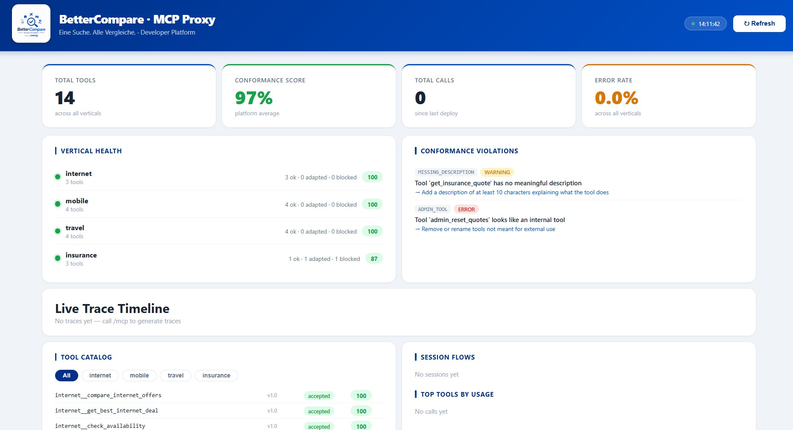

# GenDev9 – CHECK24 ChatGPT App Challenge
**BetterCompare – One Search. Every Comparison.** 
[🎥 Demo Video](#) · [📊 Dashboard](https://bettercompare.dev/dashboard) · [🌐 MCP Endpoint](https://bettercompare.dev/mcp)
 
---
 
## Intro
 
Thank you for taking the time to look at my project for the CHECK24 GenDev Scholarship.

The challenge grabbed me from the start: how do you bring multiple independent APIs together in a way that an AI model like ChatGPT can use them cleanly and reliably without chaos, naming conflicts, or blind spots? That's exactly what I set out to solve with BetterCompare, a ChatGPT-native MCP proxy that aggregates multiple CHECK24 comparison verticals into a single unified interface, powered by a conformance engine, live monitoring, and structured developer feedback.

It was my first time diving deep into the MCP protocol, and I quickly realized how much care it takes to make tools truly ChatGPT-ready: clear descriptions, consistent schemas, meaningful error messages. What looks like a simple routing problem at first glance turns into a question of architecture and trust as the proxy needs to work as a reliable gatekeeper, not just a pass-through.

The heart ❤️ of the project is the Conformance Engine: it validates every tool against structured rules and gives vertical teams concrete, actionable feedback. It is not just a rejection, but a clear "here's the problem, and here's how to fix it." That part was especially satisfying to build.


---

## 🚀 Live Demo

| Service | URL |
|---|---|
| 🌐 Proxy MCP Endpoint | https://bettercompare.dev/mcp |
| 📊 Monitoring Dashboard | https://bettercompare.dev/dashboard |
| 🔍 OpenAPI Schema | https://bettercompare.dev/openapi-schema |
| 💬 Feedback | https://bettercompare.dev/feedback |
| 📋 Catalog | https://bettercompare.dev/catalog |
| 🔢 Versions | https://bettercompare.dev/versions |

> ⚠️ ChatGPT connects **only** to the proxy MCP. All vertical MCPs run internally and are never exposed directly.

---

## 🎥 Video

📺 **Demo Video:** `<VIDEO_LINK_HERE>`

The video covers:
- Architecture explanation
- Live dashboard walkthrough
- ChatGPT tool call demonstration
- Conformance engine in action
- Versioning and feedback system

---

## 📁 Repository Structure

```
BetterCompare/
├── proxy/
│   ├── main.py                  ← MCP proxy core
│   ├── requirements.txt         ← Python dependencies
│   ├── conformance/
│   │   └── engine.py            ← Rule engine (schema, safety, naming, UX)
│   ├── monitoring/
│   │   ├── tracer.py            ← Per-request tracing with correlation IDs
│   │   ├── stats.py             ← Metrics aggregation per vertical
│   │   └── session_store.py     ← Session-level tool usage tracking
│   ├── feedback/
│   │   └── store.py             ← Actionable feedback per vertical team
│   ├── catalog/
│   │   └── versions.py          ← Versioning + breaking change detection
│   ├── dashboard/
│   │   ├── index.html           ← Live monitoring dashboard
│   │   └── BetterCompare.png    ← Logo
│   └── verticals/
│       ├── internet/main.py     ← Port 8801
│       ├── mobile/main.py       ← Port 8802
│       ├── travel/main.py       ← Port 8803
│       └── insurance/main.py    ← Port 8804
├── Dockerfile
├── start.sh
└── privacy.md
```

## ✅ Challenge Requirements

### Single ChatGPT-facing Proxy MCP
- Exactly one MCP endpoint: `POST https://bettercompare.dev/mcp`
- All verticals hidden behind the proxy
- Proxy handles: tool aggregation, routing, conformance, feedback

### Vertical MCPs (Mocked)
4 independent FastAPI servers, each owning their own tools:

| Vertical | Tools | Port |
|---|---|---|
| Internet | compare_internet_offers, get_best_internet_deal, check_availability | 8801 |
| Mobile | compare_mobile_plans, get_best_mobile_deal, check_network_coverage, compare_phone_hardware | 8802 |
| Travel | search_travel_offers, search_flights, search_hotels, get_travel_insurance | 8803 |
| Insurance | compare_insurance_plans, get_insurance_quote, list_insurance_types | 8804 |

### Conformance Engine
Every tool is evaluated against structured rules before exposure:

```json
{
  "rule_id": "MISSING_DESCRIPTION",
  "group": "schema",
  "severity": "WARNING",
  "reason": "Tool 'get_insurance_quote' has no meaningful description",
  "fix": "Add a description of at least 10 characters explaining what the tool does"
}
```

Rules are grouped into: `schema`, `safety`, `naming`, `ux`

Each violation includes a `fix` field — vertical teams know exactly what to change.

### Versioning

```json
{
  "proxy_version": "1.0.0",
  "catalog_version": "2026-04-30",
  "verticals": {
    "internet": {"version": "1.2.0", "status": "stable"},
    "insurance": {"version": "0.9.0", "status": "beta"}
  }
}
```

- Breaking change detection (new required params, type changes)
- `GET /versions` — full version manifest
- `GET /versions/check?vertical=insurance` — per-vertical status

### Feedback to Verticals
`GET /feedback?vertical=insurance` returns:

```json
{
  "vertical": "insurance",
  "score": 87,
  "tools": [
    {
      "tool": "get_insurance_quote",
      "status": "adapted",
      "violations": [
        {
          "rule_id": "MISSING_DESCRIPTION",
          "severity": "WARNING",
          "reason": "Tool has no meaningful description",
          "fix": "Add a description of at least 10 characters"
        }
      ]
    }
  ]
}
```

---

## 🏗️ Architecture

```
ChatGPT / MCP Inspector
         │
         ▼
┌────────────────────────────────────┐
│      BetterCompare MCP Proxy       │
│        bettercompare.dev           │
│                                    │
│  ┌─────────────┐ ┌──────────────┐  │
│  │ Conformance │ │   Routing    │  │
│  │   Engine    │ │ + Namespace  │  │
│  └─────────────┘ └──────────────┘  │
│  ┌─────────────┐ ┌──────────────┐  │
│  │  Monitoring │ │   Feedback   │  │
│  │  + Tracing  │ │   Engine     │  │
│  └─────────────┘ └──────────────┘  │
└──────────────┬─────────────────────┘
               │ internal only
    ┌──────────┼──────────┬──────────┐
    ▼          ▼          ▼          ▼
 :8801      :8802      :8803      :8804
Internet   Mobile     Travel   Insurance
```

## 🔌 API Reference

| Endpoint | Method | Description |
|---|---|---|
| `/mcp` | POST | MCP endpoint for ChatGPT |
| `/mcp?vertical=internet` | POST | QA mode — only internet tools |
| `/health` | GET | Vertical reachability |
| `/catalog` | GET | Full tool catalog |
| `/feedback` | GET | Conformance feedback (all verticals) |
| `/feedback?vertical=X` | GET | Feedback for one vertical |
| `/traces` | GET | Recent tool call traces |
| `/stats` | GET | Aggregated metrics |
| `/sessions` | GET | Session-level tool usage |
| `/versions` | GET | Version manifest |
| `/versions/check?vertical=X` | GET | Per-vertical version status |
| `/dashboard` | GET | Live monitoring dashboard |
| `/reload` | POST | Invalidate tool cache |
| `/openapi-schema` | GET | OpenAPI schema for ChatGPT Actions |

### Per-Vertical QA Mode
```bash
# Via query param
POST https://bettercompare.dev/mcp?vertical=internet

# Via header
POST https://bettercompare.dev/mcp
x-vertical: internet
```

### Connecting to ChatGPT
1. Go to [chatgpt.com/gpts/editor](https://chatgpt.com/gpts/editor)
2. Click **Configure** → **Actions** → **Add actions**
3. Click **Import from URL** and enter: https://bettercompare.dev/openapi-schema
4. ChatGPT will discover all tools automatically

---

## ⭐ Optional Features

### Cross-Vertical Namespacing
All tools are namespaced as `vertical__tool_name`:
- `internet__compare_internet_offers`
- `travel__search_flights`

Prevents naming conflicts between verticals. ChatGPT always knows which vertical owns which tool.

### Live Monitoring Dashboard

`https://bettercompare.dev/dashboard`

Shows:
- Total tools + conformance score
- Vertical health (green/amber/red)
- Conformance violations with fix suggestions
- Live trace timeline
- Session flows
- Top tools by usage

### Session-Level Insights
`GET /sessions` tracks tool usage across a conversation:

```json
{
  "session_id": "sess_abc123",
  "flow": "internet__compare_internet_offers → travel__search_flights",
  "total_calls": 2,
  "verticals_used": ["internet", "travel"]
}
```

### Structured Tracing
Every tool call gets a `correlation_id` with per-step latency:

```json
{
  "correlation_id": "req_a3f9",
  "tool_name": "internet__compare_internet_offers",
  "total_ms": 142,
  "steps": [
    {"name": "conformance", "at_ms": 4},
    {"name": "vertical_call", "at_ms": 11}
  ],
  "status": "ok"
}
```

---

## 🔒 Security Considerations

- **Tool exposure**: Conformance layer blocks admin/debug tools from leaking to ChatGPT
- **Input validation**: JSON Schema validation on every tool call
- **Trust boundaries**: Proxy trusts vertical responses at application level. Production would use mTLS between proxy and verticals
- **No auth on proxy**: Correct for developer/connector mode. Production would add API key or OAuth at gateway layer
- **What to harden next**: Rate limiting per session, request size limits, circuit breakers for unreachable verticals, audit logging

---

## ☁️ Deployment

Runs as a single Docker container on Railway:

```bash
# Local
docker build -t bettercompare .
docker run -p 8787:8787 bettercompare
```

Deployed at: **https://bettercompare.dev**

---

## 🚧 Known Limitations & Trade-offs

| What | Simplified | Production improvement |
|---|---|---|
| Trace storage | In-memory | ClickHouse or Grafana Tempo |
| Session state | In-memory | Redis with TTL |
| Vertical auth | None | mTLS per vertical |
| Ambiguity resolution | Namespacing only | ML-based intent classifier |
| Conformance scoring | Heuristic | ML-assisted against ChatGPT behavior logs |

**Cross-vertical ambiguity** cannot be fully solved. Namespacing prevents collisions but "find me a deal for my trip" could match travel or insurance. Current mitigation: clear tool descriptions + namespacing.

---

## 🧠 Key Design Decisions

**Proxy as Gatekeeper**: All tools pass through validation before exposure. Vertical teams get structured, actionable feedback — not just rejection.

**Vertical Independence**: Each vertical owns its tools and schemas. The proxy never assumes a global naming scheme.

**Stability over Flexibility**: The proxy absorbs breaking changes so ChatGPT remains stable after review approval.

**Separation of Concerns**: MCP protocol layer is separate from platform logic (conformance, routing, monitoring) so the core could be reused with other MCP-compatible hosts like Claude.

---
## Outro
 
I hope BetterCompare demonstrates how I approach complex architecture problems: with a focus on robustness, clear feedback for other teams, and a system that holds up cleanly under real conditions.
 
I'm happy to answer any questions about the project and welcome any feedback.


*Made with ❤️ by Julia Goihman*

*GenDev9 – CHECK24 ChatGPT App Challenge*

   


